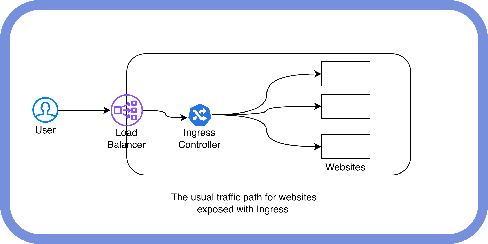

On November 11, 2025 Kubernetes community got [the news](https://kubernetes.io/blog/2025/11/11/ingress-nginx-retirement/) that Ingress NGINX controller is retiring. It is an important and I believe one of the most popular products that was used in the Cloud Native ecosystem. 

In this blog post we will look deeper into what is happening, what are the alternatives and what is happening next. 

## What is ingress and ingress NGINX?

"Ingress is the original user-friendly way to direct network traffic to workloads running on Kubernetes." 

In simpler words, it is the easiest and most common approach to expose applications via HTTP(s) that are running in your Kubernetes cluster. And yes, TCP is also supported, but HTTP(s) was the main use case.

For ingress resources to function, there must be an ingress controller. Its role is to manage necessary resources (secrets, services, etc), but also to proxy the traffic.

There are [numerous implementations](https://kubernetes.io/docs/concepts/services-networking/ingress-controllers/) of ingress controllers. The most popular one was [ingress-nginx](https://github.com/kubernetes/ingress-nginx) (do not confuse it with [F5 NGINX Ingress](https://docs.nginx.com/nginx-ingress-controller/)). It is nginx based and is community maintained. And this is the one that is going to retire in March 2026.

## The retirement

It is important to understand that it is only the controller that is retiring, not the whole Ingress API. In the retirement blog it is a bit confusing, cause in the beginning readers immediately see the recommendation to move to Gateway API. Also as the blog states, your ingress resources will obviously continue to work, as it is just the development of new versions will stop. 

Despite being popular with users, the Ingress NGINX project has consistently suffered from a severe lack of maintenance. For years, development was handled by only one or two people working in their spare time (nights and weekends). This led the maintainers to [announce plans](https://kccncna2024.sched.com/event/1hoxW/securing-the-future-of-ingress-nginx-james-strong-isovalent-marco-ebert-giant-swarm) last year to wind down Ingress NGINX and collaborate with the Gateway API community on a replacement called InGate. However, even this significant announcement failed to attract the necessary help to maintain Ingress NGINX or develop InGate, which also stalled and will now be retired.

## What are the alternatives?

If you are using the ingress-nginx controller, there are two paths for you:

1. **Use another ingress controller.** See the curated list [here](https://kubernetes.io/docs/concepts/services-networking/ingress-controllers/).
2. **Switch to [Gateway API](https://gateway-api.sigs.k8s.io/).**

The Gateway API is the successor to Ingress because it was designed to overcome the critical limitations of the older API:

- **Role-Oriented Design:** It clearly separates network infrastructure configuration (managed by operators) from application routing rules (managed by developers). This improves security and reduces configuration conflicts.
- **Built-in Advanced Features:** Unlike Ingress, which relied heavily on controller-specific annotations, the Gateway API natively supports advanced traffic management features (e.g., canary rollouts, traffic mirroring, header matching).
- **Protocol Flexibility:** It supports standard routing for HTTP, HTTPS, TCP, UDP, and gRPC as core resources, whereas Ingress is primarily limited to HTTP/S.
- **Portability and Extensibility:** Configurations are standardized, making it easier to switch between different Kubernetes controllers without rewriting complex rules, ensuring a more future-proof and vendor-agnostic environment.

Switching to Gateway API can be a straightforward process with tools like [ingress2gateway](https://github.com/kubernetes-sigs/ingress2gateway).

## Conclusion

It is a sad moment for the community when the beloved project is retiring due to lack of maintenance, not because of competitive edge. At the same time the future is bright as there are lots of alternatives - other ingress controllers and Gateway API. 

For Everest, we [support ingress exposure](https://docs.percona.com/everest/install/install_everest_and_expose_via_ingress.html). For that you can set specific flags and expose Everest via ingress without any additional configurations. Stay tuned for new blogs and documentation articles about Gateway API.
